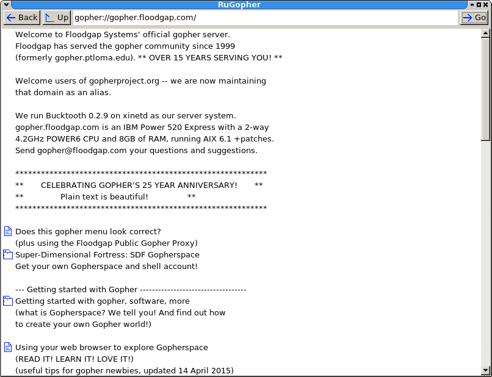

RuGopher
========

A Ruby and FXRuby (FOX Toolkit)-based Gopher client, and a Ruby class for accessing Gopher sites.

Features:

 * Browsing gopherspace
 * Downloading files

Upcoming features:

 * Bookmarks
 * History, back/forward
 * Search

Screenshot:

