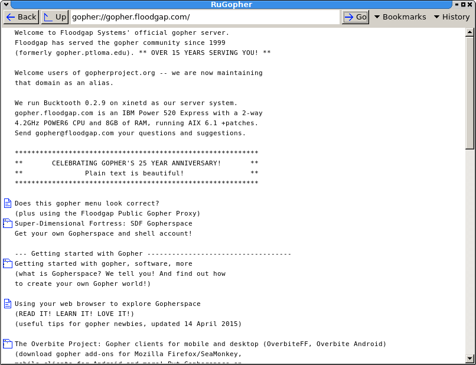

RuGopher
========

A Ruby and FXRuby (FOX Toolkit)-based Gopher client, and a Ruby class for accessing Gopher sites.

Features:

 * Browsing gopherspace
 * Downloading files
 * Search
 * Bookmarks (specify in bookmarks.txt)

Upcoming features:

 * History, back/forward

Screenshot:

Why use Gopher in ~~2016~~ 2018?
-----------------------

At the beginning, the World Wide Web and Gopher were close both in their aims and methods. However, the web quickly evolved into what it is today while Gopher became stagnant as a result of licensing problems. But has Gopher became obsolete? I don't think so. Gopher still have some advantages over the web.

First, Gopher, because of its relative obscurity is free from commercial interests. Thus, Gopher is mostly ad- and tracking-free as most of the network in run by individuals with some servers belong to institutions.

Moreover, Gopher's simplicity is a significant advantage: while the web becomes more bloated every day by unneeded Javascript and complicated layouts, Gopher stayed simple and as a result is still accessible to "obsolete" platforms like older computers and phones, and also to people relying on slow connections, for example in developing countries.

Finally, Gopher stayed true to the web's original idea: being a place to share data and knowledge. What's more, is that Gopher also stayed decentralized unlike the web where Google and Facebook are the central points. Gopher doesn't have a central index like Google [1], but is instead made of a network of interconnected nodes owned by the community, favoring the quality of its contents over centralization and commercial interests.

[1] The Veronica search engine could be thought as a central index, but it has neither the scope nor the variety of services Google offers

If you are interested in the Gopher project, please visit gopher://gopherproject.org using your preferred Gopher client.

Downloading RuGopher
--------------------

First, install ruby and [FXRuby](https://github.com/larskanis/fxruby#install). You can then download and run RuGopher:

    ruby main.rb
